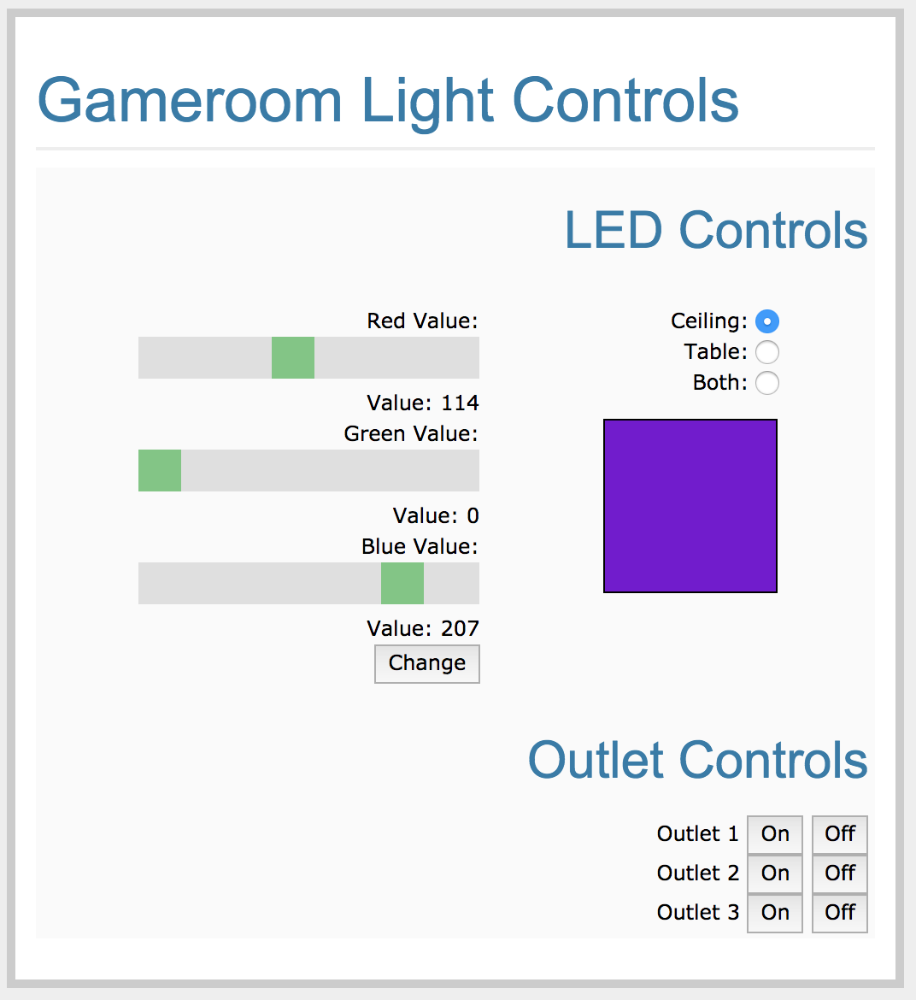

# Light Controls with a Raspberry Pi

My roommate and I have a game room, where we will play board games or tabletop roleplaying games when we have friends over. Especially in the context of tabletop RPGs it's nice to be able to control the atmosphere, and lighting is one of the most powerful tools you can use to create mood. I had recently bought a Raspberry Pi, and I was looking for a project, so I decided to set up a light control system using the Raspberry Pi. 

## Materials
### Preliminary Work
I purchased 10 meters worth of RGB LED strips in two 5 meter rolls to run along the ceiling. They required 12V DC current at 72W per 5 meter length (maximum). The power supply provided with the 10 meter length would output 12V at 5A:
```
Watts = Amps x Voltage 
Watts = 5A x 12V
60W
```
That's less than optimal - even for one LED strip - and that was reflected in the product reviews. But at $20 for 10 meters, the price was definitely right. I purchased a separate 12V 10A power supply and used it to power the LEDs instead.


I ran the LED strips along the edge of the ceiling. To go around corners I cut them and used flexible strip connectors to link the segments together. Because of the way the LED strips are designed, the LEDs at the end of the strip would be less bright if I connected power to one end and ran it through the entire length of the strip, so I powered both 5 meter long sections in parallel.
### Connecting the Raspberry Pi


Now to connect the LEDs to the Raspberry Pi. Our Raspberry Pi can interact with other devices through GPIO pins - or General Purpose In/Out pins. However, the voltage we're running through the LED strips is 12V 10A, whereas the Raspberry Pi GPIO voltage is 3.3V. That's more than enough to fry our Pi, so we need some way to let our Pi control the flow of current through the LEDs without ever being exposed to that voltage. 

The obvious choice is to use MOSFETs. Each MOSFET has a gate, source, and drain pin. To oversimplify a little, think of it as a faucet. Water (current) flows in through the source pin and out through the drain pin. The gate pin is the tap - by connecting one of our GPIO pins and applying a voltage we can turn the faucet on or off. It's not quite that simple, because when the faucet is 'half on' what we're actually doing is flipping the switch on and off very quickly - but it gets across the basic idea. 


The LED strip is attached to the 12V power supply, and the red, green, and blue wires - which correspond to the red, green, and blue ground connections - are each attached to the source pin of a MOSFET. Then the GPIO we have designated to control each color is attached to the respective gate pin, and the drain pins are then connected to ground. Now we have the hardware in place to control the flow of current from our power supply, through the LED strips, and down to ground for each color.

## Controlling GPIO with Raspberry Pi
When I started tinkering with this project in early 2017 I was new to home automation. I can't give enough credit to David Ordnung, who wrote an excellent tutorial [that you can find here](https://dordnung.de/raspberrypi-ledstrip/). Because of this excellent tutorial, I chose to use the [Pigpio library for the Raspberry Pi](http://abyz.me.uk/rpi/pigpio/). This gives us the tools to control whether a pin is on or off, as well as supporting PWM (pulse width modulation) which lets us control the 'amount' of red, green, and blue. It also has the pigpiod daemon, which lets us check that everything is working before we go any further. The daeomon can be started with:
```
sudo pigpiod
```

I assigned the blue LED to GPIO 26, so if at this point we wanted to check that it was functional, we could type:

```
pigs p 26 255
```
Note that PWM operates on a scale of 0-255, so the line above is telling our Raspberry Pi to power the blue LEDs with a 100% duty cycle. By using values between 0 and 255, we can provide more or less power to each color.


Within Python code, it would look something like this:

```python
import pigpio

pi1 = pigpio.pi() # pi1 accesses local GPIO
pi1.set_mode(26,pigpio.OUTPUT)  # sets this GPIO pin as output. Not necessary, but 
                                # used in the documentation. Seems like best practices
pi1.set_PWM_dutycycle(26,255) # set pin 26 to 100% duty cycle
```
Once we have those basics down, the rest is pretty straightforward. [Here's a jupyter notebook with some sample code to play around with](../master/src/sample_pigpio.ipynb),

## RF Outlets

I owned a few RF controlled outlets, and I was interested in seeing if I could control them through my Pi. My roommate had a few neon lights, and being able to turn them on and off through the same interface as the LED strips was an attractive prospect. They came with a remote control that sends a signal on a 433.92MHz frequency. If I wanted to control the outlets using my Pi I would need to record the signal send by the remote, figure out what the signal looks like, and then set up code to transmit the same signal.


First of all, let me give credit where credit is due. I used an excellent tutorial [found here](http://www.instructables.com/id/Super-Simple-Raspberry-Pi-433MHz-Home-Automation/) to get started, and I would highly recommend anyone who's considering this to project take a look. 

I bought an RF transmitter and receiver chip very cheaply from Amazon - about $7.00 for both chips. I connected these to GPIO pins on my Raspberry Pi, and then adapted some code from the tutorial to record the signals from the remote control. The tutorial mentioned above had a brute force approach to figuring out what the signal looks like, involving zooming in on a packet, writing down the long and short impulses, and then measuring the length of the impulses. 

I didn't have luck with the brute force method, so I wrote a very, very simple version of the K-Means algorithm to figure out the duration of each impulse and each pause.  


## Making A Flask App
In the sample repository there was a program that asked the user to enter three values between 0 and 255 for the red, green, and blue color values. In practice this would be time consuming and unintuitive. While I was testing the LEDs I quickly realized how hard it is to guess the proportions required to achieve a particular color! It's also cumbersome to access the Pi's command line whenever you want to change the lights. You can use SSH to access your Pi easily enough, and then pull up the program to change the lights, but it takes time and can easily ruin the mood of a tabletop RPG session.

The solution is to set up a web app - so you can interact with the LEDs through an attractive, intuitive GUI. I have the code for the completed project in [this repository](../master/flask_app), but if you're not sure where to start I've been putting together a step-by-step tutorial [that you can find here](https://github.com/timothy-salazar/light-control-tutorial).

I wouldn't have known where to start without this excellent [flask tutorial](http://flask.pocoo.org/docs/0.12/tutorial/). The sliders were adapted from [w3schools.com](https://www.w3schools.com/howto/howto_js_rangeslider.asp) - which has been an invaluable resource at every step of this project.


<p align="center">
  
</p>


## Works Cited

#### [Raspberry Pi & RGB LED-Strips](https://dordnung.de/raspberrypi-ledstrip/), David Ordung
* David Ordung's tutorial walked me through the first part of this project when I was still a babe in the woods. I knew what I wanted to do, but I wasn't sure how to go about it. David patiently and lucidly explained each step along the way and made the project seem easy and do-able. 

#### [SUPER SIMPLE RASPBERRY PI 433MHZ HOME AUTOMATION](http://www.instructables.com/id/Super-Simple-Raspberry-Pi-433MHz-Home-Automation/), George7378
* This tutorial explained the hardware I would need and guided me step by step through the process of sniffing the RF code from the remote, getting the code, and then setting up a program to transmit that code. I adapted or changed a lot, but his example code is what got me started, and the rf_sniffer code he provided is basically unchanged - all I did was update it to Python 3.

#### [Flask Documentation](http://flask.pocoo.org/docs/0.12/)
* Provided the bones for the webpage. I'd never built a webpage before, so I started with the template provided in the Flaskr app and modified it piece by piece as I figured out how everything worked.

#### [w3schools.com](https://www.w3schools.com/)
* I've never worked with HTML or Javascript before. w3schools.com is an amazing resource that thoroughly covers everything I needed to know.


